# Key Management

## Introduction

A _Vault_ in OCI is a secure container used to store and manage _Encryption Keys_ and _Secrets_, offering options like Standard or Virtual Private Vaults for different security and isolation needs. 
A _Master Encryption Key_ is a key stored in the _Vault_, used to encrypt and decrypt data encryption keys or directly protect sensitive data. 

In this lab you create the required OCI resources to use a customer-managed key for data-at-rest encryption in Object Storage and 
Block Volume.

Estimated Time: 30 minutes

### About Vault

OCI Vault is a secure service designed to centrally manage encryption keys and secrets, ensuring robust data protection and compliance. It supports customer-managed keys (CMKs), Oracle-managed keys, and Bring Your Own Key (BYOK) for full control over key lifecycle management. Encryption keys stored in the vault enable seamless integration with OCI services, providing encryption for data at rest and in transit with fine-grained access control.

### Objectives

In this lab, you will:

* Create a Vault
* Create a Master Encryption Key
* Create a private Object Storage bucket with a custom-managed key
* Change the encryption key of a Block Volume to a customer-managed key

### Prerequisites (Optional)

This lab assumes you have:
* An Oracle Cloud account
* All previous labs successfully completed

## Task 1: Create Vault

1. Click the Navigation Menu in the upper left, navigate to Identity & Security, and select Vault. Select the compartment you are assigned to (check which compartment you are assigned where you have provisioned the Livelabs resources).

	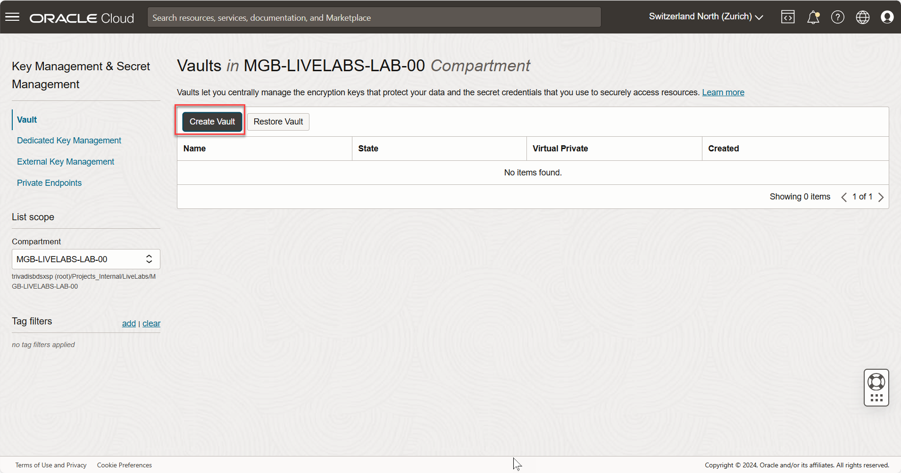

2. Click **Create Vault**. We create a new Vault for this lab.

	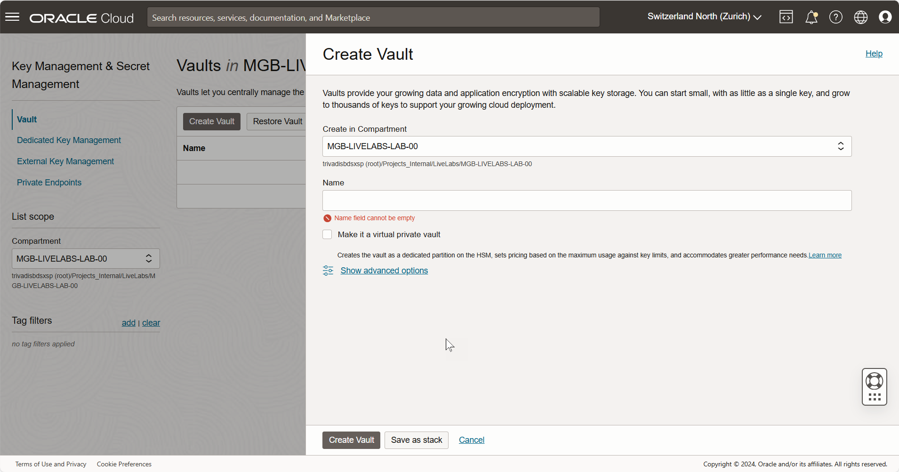

3. Insert Vault name, as example _vault-livelab_. Do *NOT* enable private vault. Click on **Create Vault**, the vault is provisioned.

	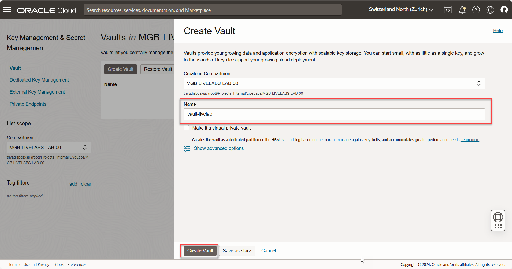

4. Verify the new created _Vault_. The state changes after some minutes from _Creating_ to _Active_.

	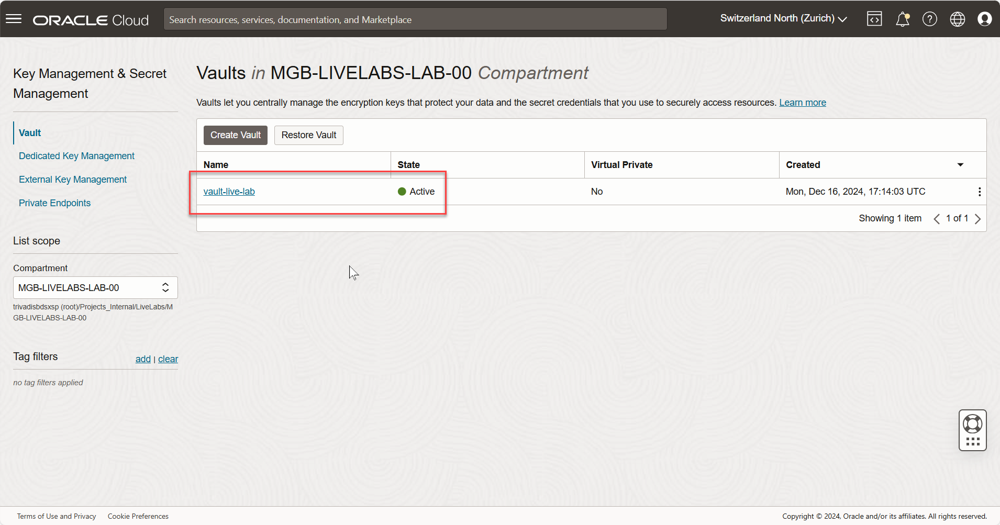

## Task 2: Create Master Encryption Key

1. In _Vault_ start page, select the previous created _Vault_, click on the **name** of the Vault to see the details.

	

2. Scroll at the bottom of the _Vault_ screen. In section _Master Encryption Keys_, create a new Master Encryption key. Click on **Create Key**.

	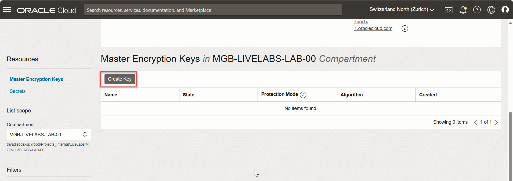

3. In **Create Key** screen, we add the information to create a new _Master Encryption Key_. Use this values:

    - **Protection Mode**: Software - __*Attention: HSM is fee-based, use Software instead!*__
    - **Name**: mek-livelab
    - **Key Shape: Algorithm**: AES
    - **Key Shape: Length**: 256 bits

	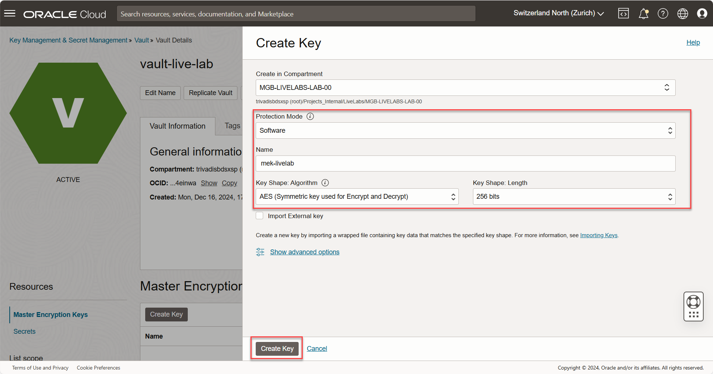

  Click on **Create Key** to create the _Master Encryption Key_.   

4. Verify the new created _Master Encryption Key_. The state changes after some minutes from _Creating_ to _Active_. The _Master Encryption Key_ is ready to use in other resources.

	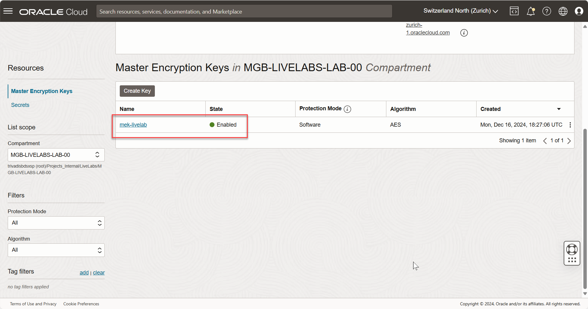

## Task 3: Create private Object Storage bucket with the Master Encryption Key

1. Click the Navigation Menu in the upper left, navigate to Storage, and select Buckets. Select the compartment you are assigned to (check which compartment you are assigned where you have provisioned the Livelabs resources).

	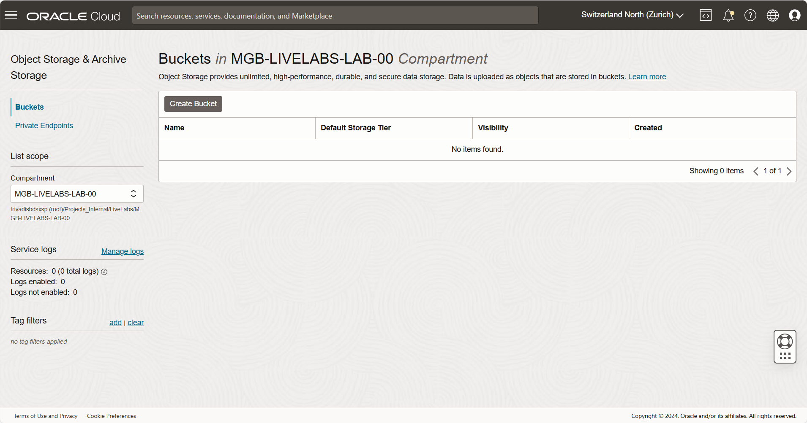

2. Click **Create Bucket**. We create a new private Object Storage bucket for this lab.

	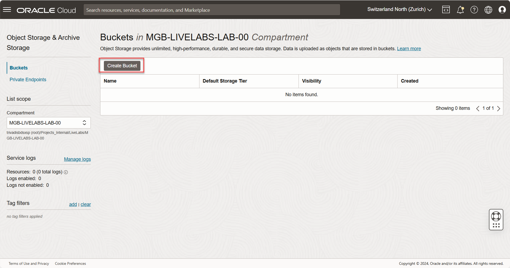

3. In **Create Bucket** screen, we add the information to create a new _Object Storage bucket_. Use this values:

    - **Bucket Name**: private_bucket_livelab
    - **Encryption**: Select Encrypt using customer-managed keys
    - **Vault in [your compartment]**: Select created _Vault_
    - **Master Encryprion Key in [your compartment]**: Select created Master Encryption Key

	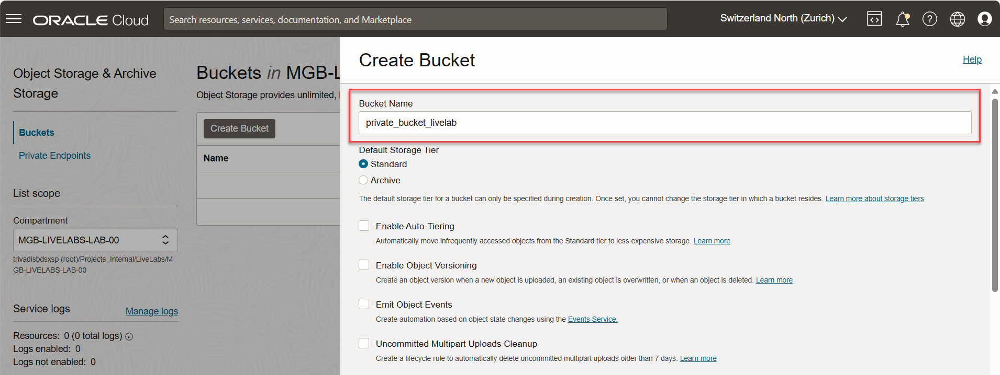

	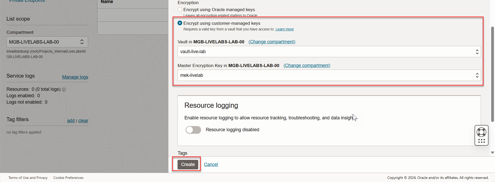
  Click on **Create** to create the _Object Storage bucket_ with the selected _Master Encryption Key_.   

4. Verify the new created _Object Storage bucket_.

	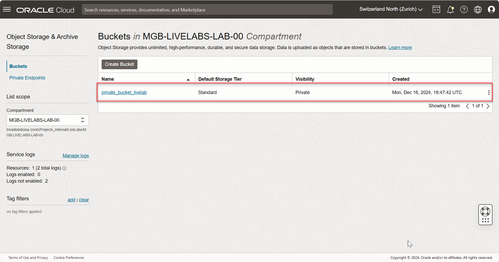

5. Click on the Objet storage name to verify new _Master Encryption Key_ is used.

	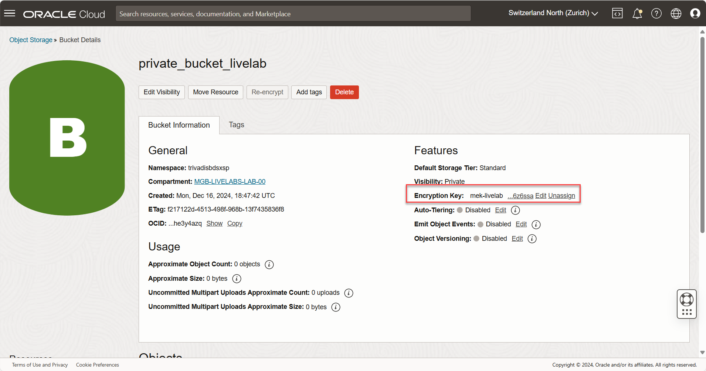

## Task 4: Change Block Volume Master Encryption Key

1. Click the Navigation Menu in the upper left, navigate to Compute, and select Instance. Select the compartment you are assigned to (check which compartment you are assigned where you have provisioned the Livelabs resources). Two compute instances are listed.

	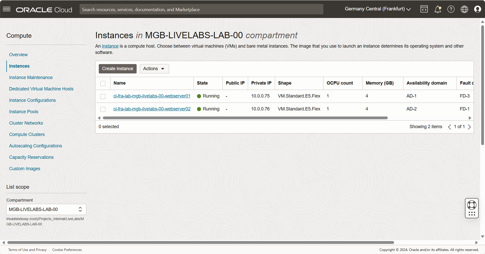

2. Select the _webserver01_ instance by click on the instance name.

	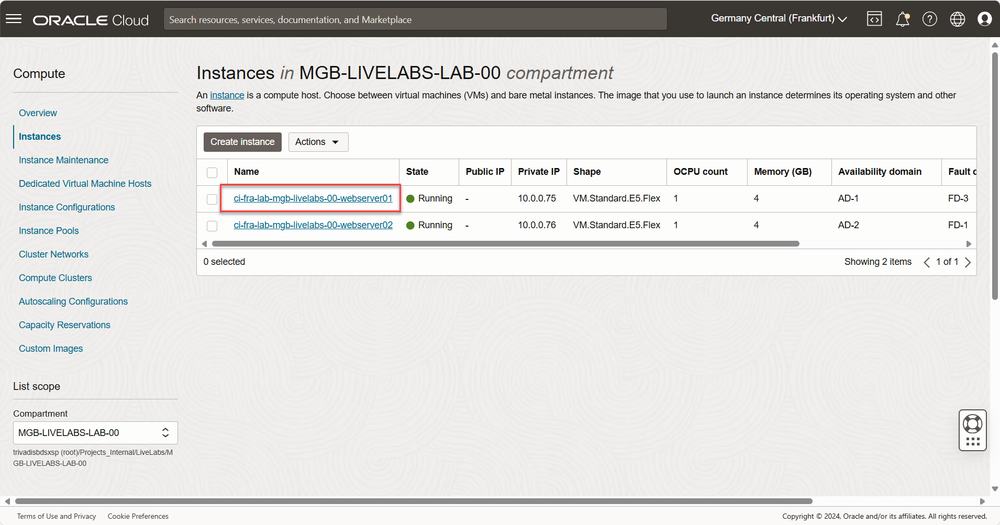

3. In the left _Resources_ column, click on **Boot volume** to see the current attached Boot Volume.

	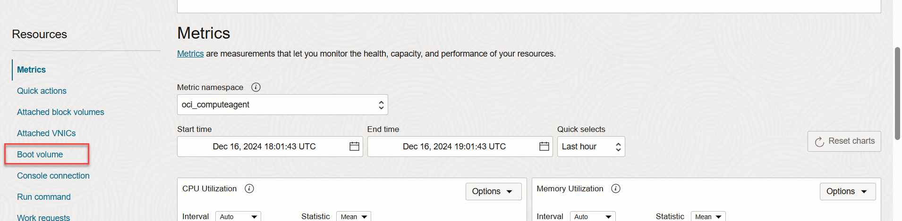

4. Click on **Boot volume name** to get the specifications of the Boot Volume.

	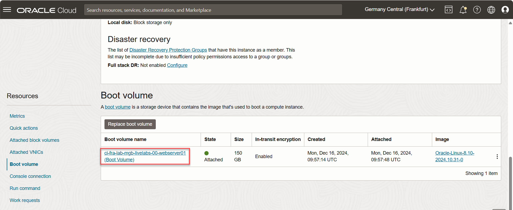

5. At the Boot Volume specification page in _Encryption key_ section, click on **Assign**.

	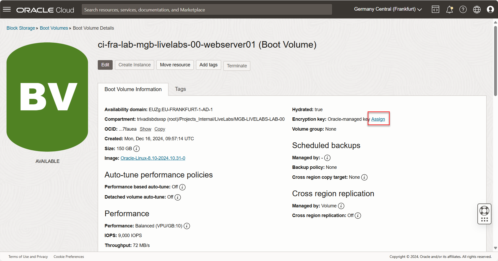

6. Select your _Vault_ and _Master Encryption Key_, click on **Assign**. You  don't see the vault? Verify the compartment first. The Boot Volume changes state temporarily _PROVISIONING_. 

	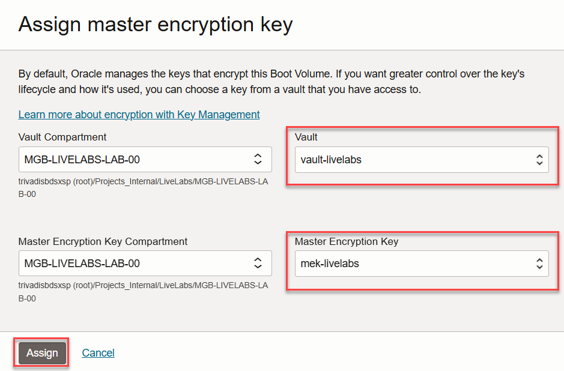

7. Verify new **Encryption key** is set.

	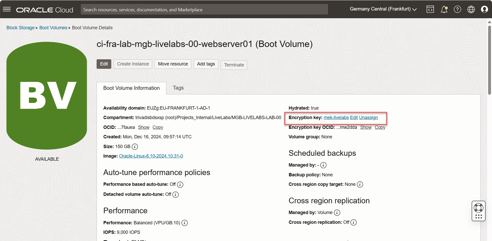

## Learn More

* [Oracle Cloud Infrastructure Documentation - Vault Start Page](https://docs.oracle.com/en-us/iaas/Content/KeyManagement/home.htm).

## Acknowledgements
* **Author** - <Name, Title, Group>
* **Contributors** -  <Name, Group> -- optional
* **Last Updated By/Date** - <Name, Month Year>
