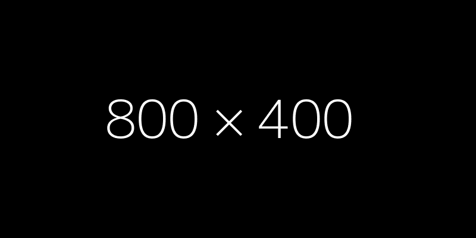
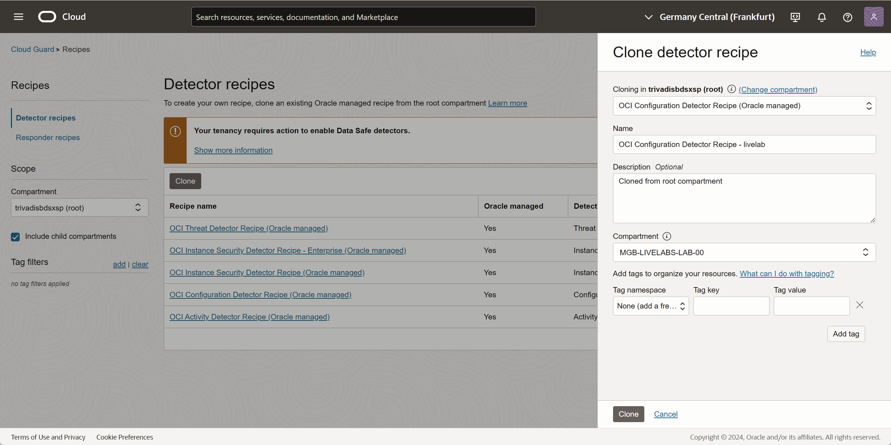
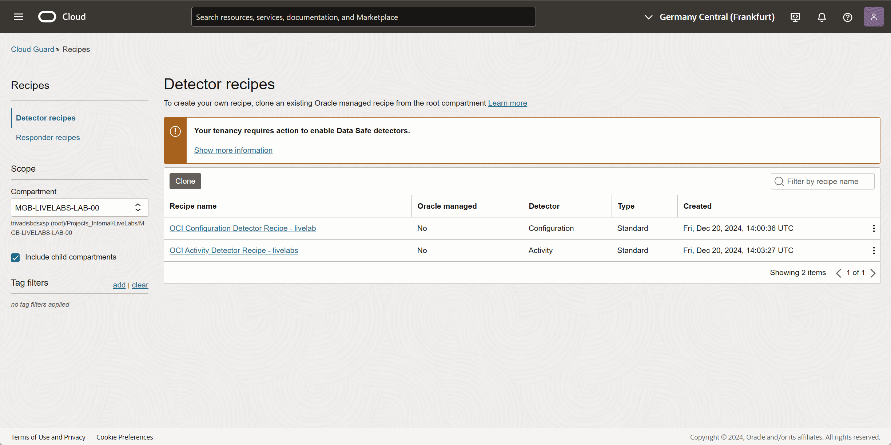
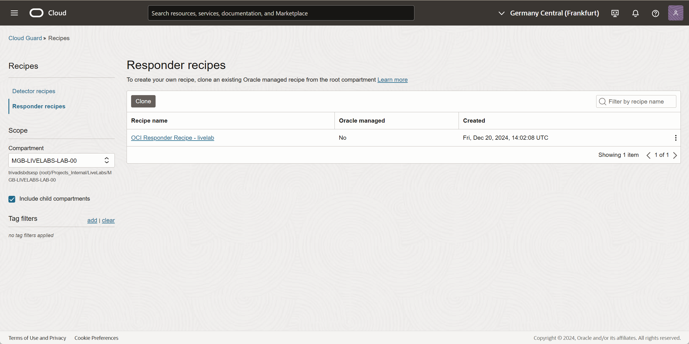

# Title of the Lab

## Introduction

 In this exercise, we will configure Cloud Guard to detect public Object Storage buckets by creating a custom detector recipe. You will also set up a target to monitor your compartment and test the configuration by creating a public bucket. By cloning existing recipes, the recipe beahvior can be adapted. As example, a Public Object Storage bucket will be changed automatically to Private visibility.

Estimated Time: 30 minutes

### About <Product/Technology> (Optional)
Enter background information here about the technology/feature or product used in this lab - no need to repeat what you covered in the introduction. Keep this section fairly concise. If you find yourself needing more than two sections/paragraphs, please utilize the "Learn More" section.

### Objectives

In this lab, you will:
* Clone an existing Oracle-managed detector recipe.
* Create a new target to monitor objects in your compartment.
* Create an Object Storage bucket and set its visibility to public.
* Verify that Cloud Guard generates an alert for the public bucket.

### Prerequisites (Optional)

This lab assumes you have:
* An Oracle Cloud account
* All previous labs successfully completed

## Task 1: Clone existing Oracle-managed Detector and Responder Recipes

1. Click the Navigation Menu in the upper left, navigate to Identity & Security, and select Cloud Guard Overview. There is no compartment selection on this page. Here you can see the Cloud Guard status for all compartmens at a glance.

	
    - OCI Instance Security Detector Recipe - Enterprise (Oracle managed)
    - OCI Instance Security Detector Recipe (Oracle managed)
    - OCI Configuration Detector Recipe (Oracle managed)
    - OCI Activity Detector Recipe (Oracle managed)

	

In this lab, we will use three of the existing recipes.

3. Clone _OCI Configuration Detector Recipe (Oracle managed)_

Click on **Clone**. 

    - **Cloning in <your root compartment>**: Select _OCI Configuration Detector Recipe (Oracle managed)_ from dropdown list
    - **Name**: OCI Configuration Detector Recipe - livelab
    - **Description**: Cloned from root compartment  
    - **Compartment**: Select your compartment     

	

Click on **Clone**. 

Repeat the steps for the other Oracle managed detector recipe:

    - OCI Activity Detector Recipe (Oracle managed)

In left resource menu, select _Responder recipes_ and repeat the step for:

    - OCI Responder Recipe (Oracle managed)

4. Verification

When selecting your compartment in left side dropdown list, you see the two new created detector recipes and one responder recipe in your compartment (non-root!).

	
	

## Task 2: Clone existing Oracle-managed responder recipe

1. Clone existing Oracle managed recipes. From left menu, select **Recipes and Clone**.

	

2. Change compartment on top to your root compartment to see the Oracle provided Cloud Guard responder recipes.

	

    - Ensure Responder recipes is select from left side menu.
    - Change compartment on top to trivadisbdsxsp (root).
    - Select recipe OCI Activity Detector Recipe (Oracle managed) from dropdown list
    - Set name for cloned recipe , as example _OCI Activity Detector Recipe - _
    - Ensure in section Compartment, your compartment is selected.

3. Verify cloned recipes
After cloning, you must have THREE detector recipes and ONE responder recipes on YOUR compartment.

Detector recipes:

	

Responder recipe:

	

## Task 3: Create a new target to observe compartment related objects

1. In this step, we create a target based in your compartment and add the recipes we created. Ensure, your compartment is selected in panel left.

Identity & Security -> Cloud Guard -> Configuration -> Targets -> Create Target

	

2. Basic Information
Add basic information and description. Use the recipes you created for your compartment.

    - Set target name according compartment, as example cg-tgt-oci-sec-ws-lab-00.
    - Add description
    - Verify compartment is correct according your work compartment.

	

Press Next at the bottom.

3. Configuration
Add basic information and description.

In Posture and threat monitoring recipes, select the OCI Configuration Detector Recipe you created for your compartment. In Instance Security recipe, select the OCI Instance Detector Recipe you created for your compartment.
Activate All compute instances.

	

Press Next at the bottom.

	

Verify you select the proper recipes based on your compartment.

Press Create at the bottom. Go back to Cloud Guard Overview page.

## Task 3:  Create a object storage bucket and change visibility to public

In this step, we create am Object Storage bucket and change visibility.

1. Create Bucket
Add basic information and description. Ensure you are in the correct compartment. If not, select your compartment in left side dropdown menu.

Go to Storage -> Object Storage -> Buckets

	

Press Create Bucket.

Set Bucket Name to public-bucket and let other settings as per default.
	

Press Create at the bottom.

2. Edit Visibility
Edit created bucket by click on the three dots -> Edit Visibility.

	

Change visibility to Public. Let checkbox setting as per default.

	

Press Save Changes at the bottom.

3.  Verification
The bucket is set to public and marked by a yellow triangle.

	

## Task 4:  Verify new Cloud Guard alert

Identity & Security -> Cloud Guard -> Alerts -> Problems

1.  Verify if the public buckets is recognized by Cloud Guard. Yiu see an entry with risk level Critical.

	

2.  Remediation
Select the alert entry by click on the bucket name to see the details and press Remediate.

	

Ignore the warning ab out missing permissions as your OCI user is not able to see the policies created on top level compartment.

	

Confirm.

	

4.  Verification 
After some seconds, the visibility for your created Object Storage bucket has changed back to Private.

Storage -> Object Storage -> Buckets

	

In Cloud Guard alert view, the state changes after a couple of seconds too.

The alert is not longer visible in alert list.

## Learn More

*(optional - include links to docs, white papers, blogs, etc)*

* [URL text 1](http://docs.oracle.com)
* [URL text 2](http://docs.oracle.com)

## Acknowledgements
* **Author** - <Name, Title, Group>
* **Contributors** -  <Name, Group> -- optional
* **Last Updated By/Date** - <Name, Month Year>
